# [Код в Google Colab](https://colab.research.google.com/drive/1vmIVrXqIcfglHiDD19XM5M8BTLCd8Keb?usp=sharing)

## Анализ прочтений
FastQC для файла SRR3824222_1.fastq: [отчёт](/files/SRR3824222_1_fastqc.html)

Особо странное соотношение нуклеотидов (очень мало С, очень много Т) можно объяснить тем, что цитозин при бисульфитном секвенировании переходит в урацил, который может распознаваться как тимин
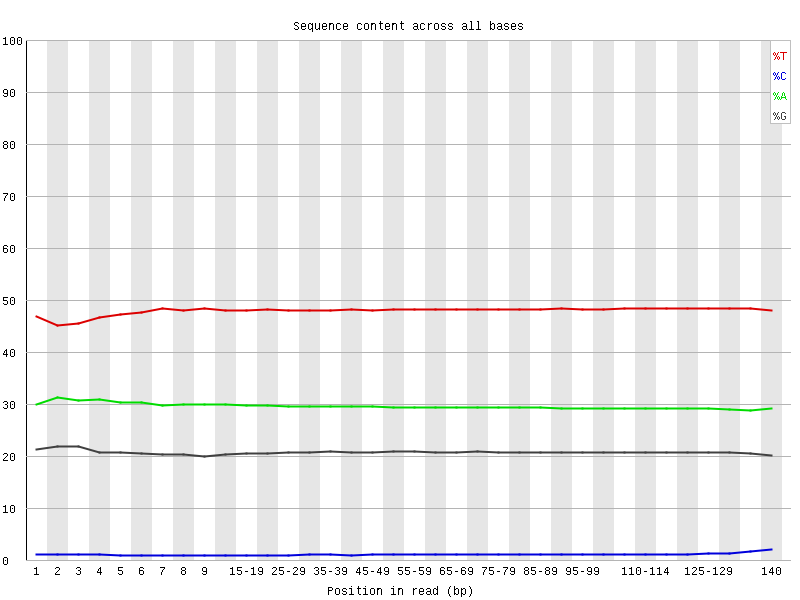

## Статистика
Стадия |	Название |	Риды на 11347700-11367700 |	Риды на 40185800-40195800 |	Дупликаций | Коллинг
-|-|-|-|-|-
8 cell |	SRR5836473 |	1090 |	464 |	18.31% | [ссылка](/files/SRR5836473_1_bismark_bt2_PE_report.html)
ICM |	SRR5836475|	1456 |	630 |	9.08% | [ссылка](/files/SRR5836475_1_bismark_bt2_PE_report.html)  
Epiblast |	SRR3824222 |	2328 |	1062 | 2.92% | [ссылка](/files/SRR3824222_1_bismark_bt2_PE_report.html)  

### M-bias plots
8 cell |	ICM | Epiblast
-|-|-
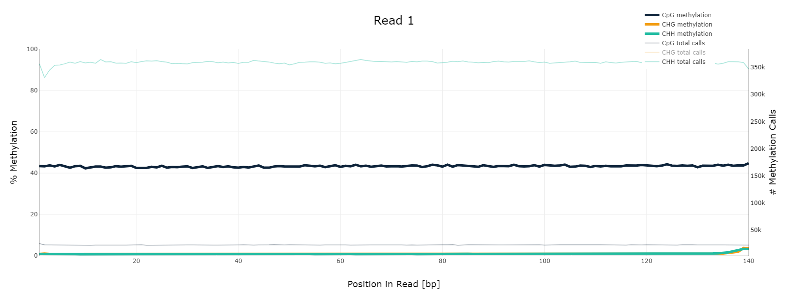 |	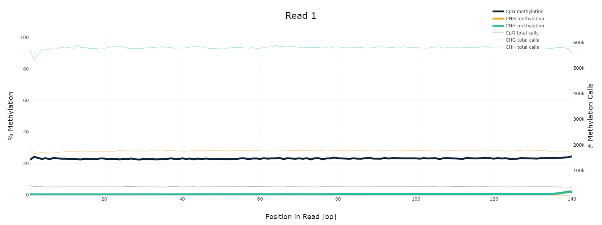 |	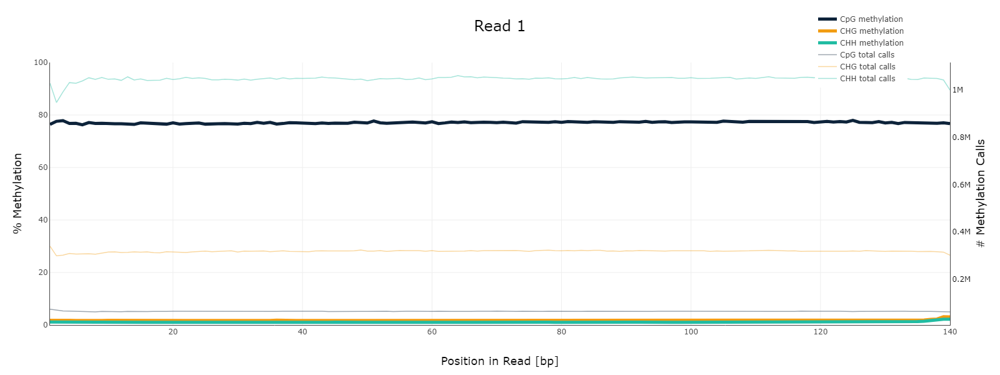
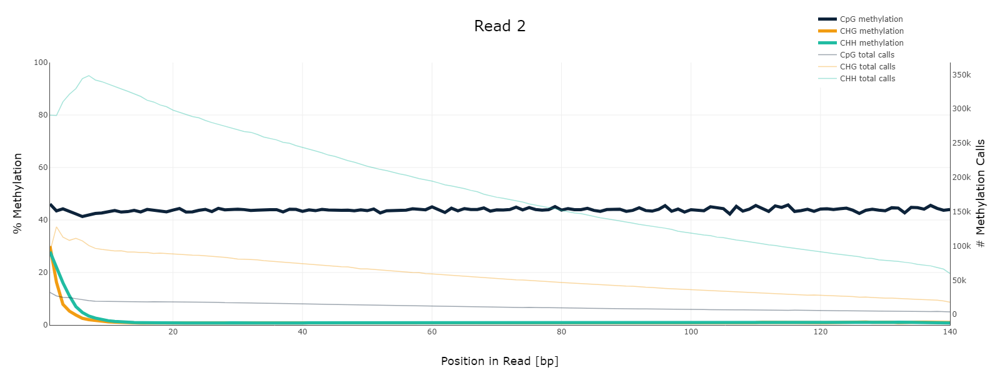 |	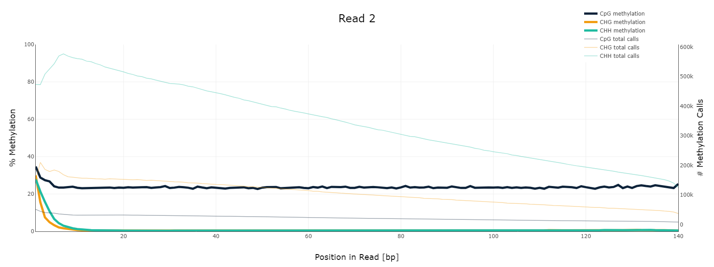 |	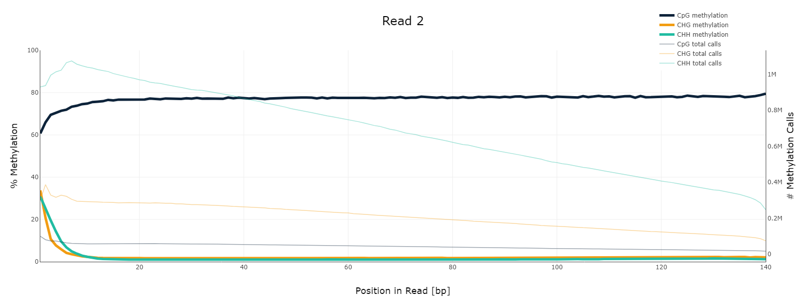

Уровень метилирования совпадает с данными из статьи: в эпибласте самый высокий, в ICM самый низкий, в 8 cell среднее значение.

В Read 2 (обратная цепь) в начале ридов уровень метилирования чуть больше / чуть меньше общего уровня, это может быть связано с особенностями  реакции, учитывать это не стоит

### Общий уровень метилирования
8 cell |	ICM | Epiblast
-|-|-
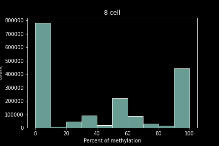 |	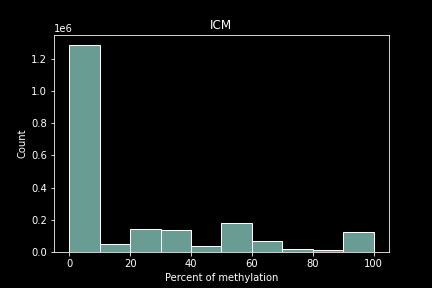 |	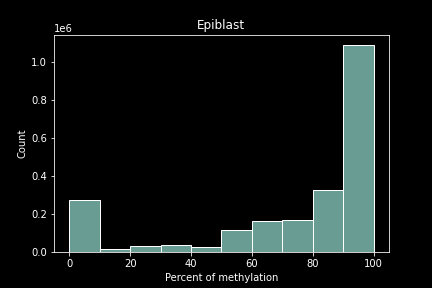

### Уровень метилирования и покрытия
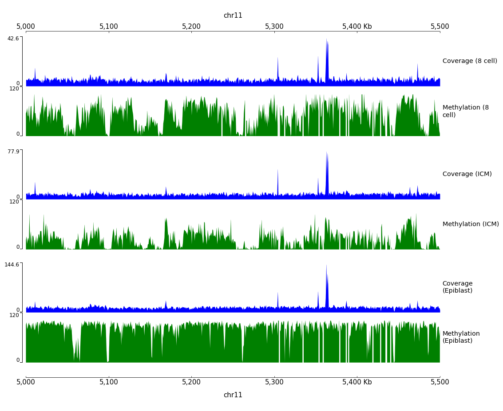
